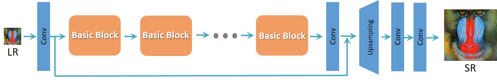
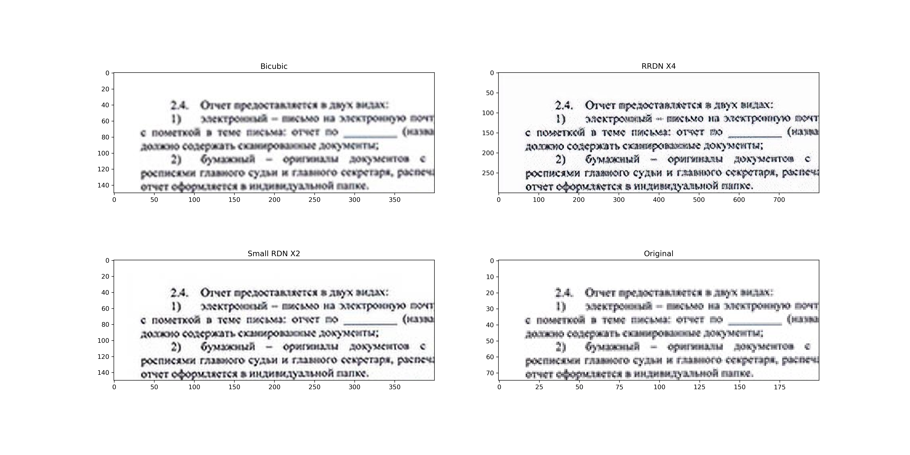
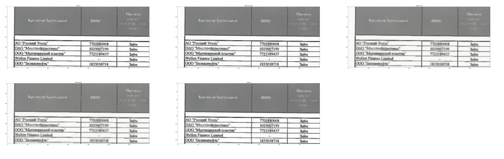
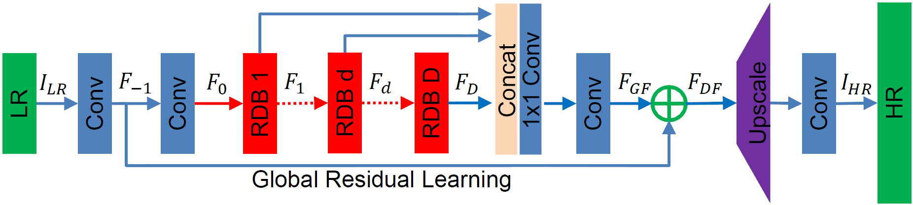

## 1 RRDN (GAN with Residial Block + VGG)
### 1.1 RRDN Network architecture
 
Original repository: https://github.com/idealo/image-super-resolution

Article: [ESRGAN: Enhanced Super-Resolution Generative Adversarial Networks](https://arxiv.org/abs/1809.00219)

The main parameters of the architecture structure are:
- T - number of Residual in Residual Dense Blocks (RRDB)
- D - number of Residual Dense Blocks (RDB) insider each RRDB
- C - number of convolutional layers stacked inside a RDB
- G - number of feature maps of each convolutional layers inside the RDBs
- G0 - number of feature maps for convolutions outside of RDBs and of each RBD output

<p align="center">
  
  <br>RRDN model
  
  <br>RRDB - residual block architecture
  
  <br>Crops predict samples 
</p>


### 1.2 Результаты
<table>
    <tr>
        <td>Description</td>
        <td>Size crop</td>
        <td>Scale</td>
        <td>Pretrain </td>
        <td>Learning </td>
    </tr>
    <tr>
        <td><a href="/rrdn-C4-D3-G32-G032-T10-x4_32x32">rrdn-C4-D3-G32-G032-T10-x4</a></td>
        <td>32x32</td>
        <td>X4 Bicubic</td>
        <td>True</td>
        <td>False</td>
    </tr>
    <tr>
        <td><a href="/rrdn-C4-D3-G32-G032-T10-x4_32x32_train">rrdn-C4-D3-G32-G032-T10-x4</a></td>
        <td>32x32</td>
        <td>X4 Bicubic</td>
        <td>True</td>
        <td>True</td>
    </tr>
    <tr>
        <td><a href="/rrdn-C4-D3-G32-G032-T10-x4_64x64_train">rrdn-C4-D3-G32-G032-T10-x4</a></td>
        <td>64x64</td>
        <td>X4 Bicubic</td>
        <td>True </td>    
        <td>True </td>
    </tr>
    <tr>
        <td><a href="/rrdn-C4-D3-G32-G032-T10-x4_100x100">rrdn-C4-D3-G32-G032-T10-x4</a></td>
        <td>100x100</td>
        <td>X4 Bicubic</td>
        <td>True</td>
        <td>True </td>
    </tr>
</table>

<p align="center">
  
  <br>Crops predict RRDM models
</p>

## 2 RDN 
### 2.1 RDN Network architecture
Article: [Residual Dense Network for Image Super-Resolution](https://arxiv.org/abs/1802.08797)

The main parameters of the architecture structure are:
- D - number of Residual Dense Blocks (RDB)
- C - number of convolutional layers stacked inside a RDB
- G - number of feature maps of each convolutional layers inside the RDBs
- G0 - number of feature maps for convolutions outside of RDBs and of each RBD output

<p align="center">
  
  <br>RDN model
   
  <br>RDB
</p>

### 2.2 RDN Pre-trained weights
The weights of the RDN network trained on the [DIV2K dataset](https://data.vision.ee.ethz.ch/cvl/DIV2K) are available in ```weights/sample_weights/rdn-C6-D20-G64-G064-x2/PSNR-driven/rdn-C6-D20-G64-G064-x2_PSNR_epoch086.hdf5```. <br>
The model was trained using ```C=6, D=20, G=64, G0=64``` as parameters (see architecture for details) for 86 epochs of 1000 batches of 8 32x32 augmented patches taken from LR images.

The artefact can cancelling weights obtained with a combination of different training sessions using different datasets and perceptual loss with VGG19 and GAN can be found at `weights/sample_weights/rdn-C6-D20-G64-G064-x2/ArtefactCancelling/rdn-C6-D20-G64-G064-x2_ArtefactCancelling_epoch219.hdf5`
We recommend using these weights only when cancelling compression artefacts is a desirable effect.

### 2.3 Результаты
<table>
    <tr>
        <td>Description</td>
        <td>Size crop</td>
        <td>Scale</td>
        <td>Pretrain </td>
        <td>Learning </td>
        <td>Metric </td>
        <td>Loss </td>
    </tr>
    <tr>
        <td><a href="/rdn-C3-D10-G64-G064-x2_32x32">rdn-C3-D10-G64-G064-x2</a></td>
        <td>32x32</td>
        <td>X2 Bicubic</td>
        <td>True</td>
        <td>False</td>
        <td>PSNR</td>
        <td>MAE</td>
    </tr>
    <tr>
        <td><a href="/rdn-C3-D10-G64-G064_x2_32x32_train">rdn-C3-D10-G64-G064-x2</a></td>
        <td>32x32</td>
        <td>X2 Bicubic</td>
        <td>True</td>
        <td>True</td>
        <td>PSNR</td>
        <td>MAE</td>
    </tr>
    <tr>
        <td><a href="/rdn-C3-D10-G64-G064_x2_64x64">rdn-C3-D10-G64-G064-x2</a></td>
        <td>64x64</td>
        <td>X2 Bicubic</td>
        <td>True</td>
        <td>True</td>
        <td>PSNR</td>
        <td>MAE</td>
    </tr>    
    <tr>
        <td><a href="/rdn-C3-D10-G64-G064_x2_200x200">rdn-C3-D10-G64-G064-x2</a></td>
        <td>200x200</td>
        <td>X2 Bicubic</td>
        <td>True</td>
        <td>True</td>
        <td>PSNR</td>
        <td>MAE</td>
    </tr>   
    <tr>
        <td><a href="">rdn-C3-D10-G64-G064-x4</a></td>
        <td>64x64</td>
        <td>X4 Bicubic</td>
        <td>False</td>
        <td>True</td>
        <td>PSNR</td>
        <td>MAE</td>
    </tr>    
    <tr>
        <td><a href="">rdn-C3-D10-G64-G064-x4</a></td>
        <td>200x200</td>
        <td>X4 Bicubic</td>
        <td>False</td>
        <td>True</td>
        <td>PSNR</td>
        <td>MAE</td>
    </tr> 
    <tr>
        <td><a href="/rdn-C3-D10-G64-G064-x2_200x200_SSIM">rdn-C3-D10-G64-G064-x2</a></td>
        <td>200x200</td>
        <td>X2 Bicubic</td>
        <td>True</td>
        <td>True</td>
        <td>PSNR/SSIM</td>
        <td>MAE+SSIM</td>
    </tr>
    <tr>
        <td><a href="/rdn-C3-D10-G64-G064-x2_200x200_MSE_SSIM">rdn-C3-D10-G64-G064-x2</a></td>
        <td>200x200</td>
        <td>X2 Bicubic</td>
        <td>True</td>
        <td>True</td>
        <td>PSNR/SSIM</td>
        <td>MSE+SSIM</td>
    </tr>
    <tr>
        <td><a href="/rdn-C3-D10-G64-G064_x2_200x200_MAE_SSIM">rdn-C3-D10-G64-G064-x2</a></td>
        <td>200x200</td>
        <td>X2 Bicubic</td>
        <td>True</td>
        <td>True</td>
        <td>PSNR/SSIM</td>
        <td>MAE+SSIM</td>
    <tr>
        <td><a href="/rdn-C3-D10-G64-G064-x2_200x200_MSE_SSIM_ANTIALIAS">rdn-C3-D10-G64-G064-x2</a></td>
        <td>200x200</td>
        <td>X2 ANTIALIAS</td>
        <td>True</td>
        <td>True</td>
        <td>PSNR/SSIM</td>
        <td>MAE+SSIM</td>
    </tr>
</table>